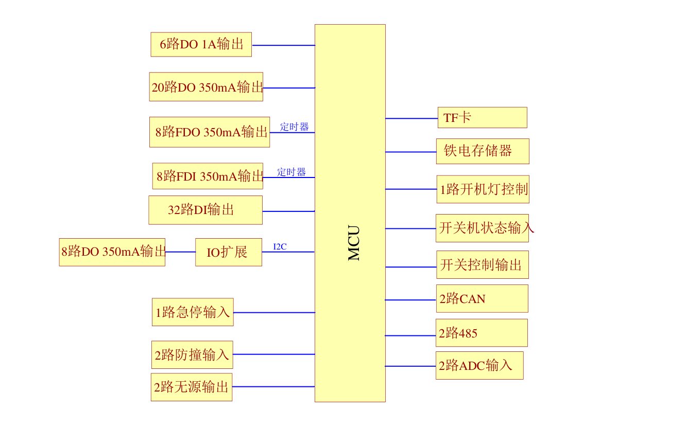
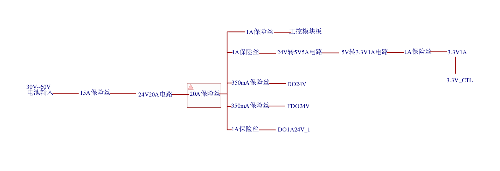

.. agv documentation master file, created by
   sphinx-quickstart on Sun Feb 11 23:08:57 2024.
   You can adapt this file completely to your liking, but it should at least
   contain the root `toctree` directive.

AGV
===============================

.. toctree::
   :maxdepth: 2
   :caption: Contents:

IO控制板

* :ref:`genindex`
* :ref:`modindex`
* :ref:`search`
